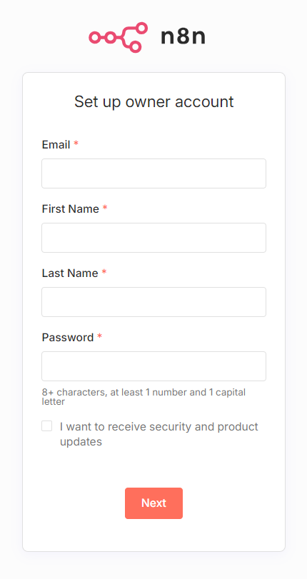

docker 사용
Starting n8n
cmd open > 명령어 수행

```
$ docker volume create n8n_data

$ 
docker run -it --rm \
 --name n8n \
 -p 8888:5678 \
 -e N8N_ENFORCE_SETTINGS_FILE_PERMISSIONS=true \
 -e N8N_RUNNERS_ENABLED=true \
 -e N8N_TUNNEL_MODE=true \
 -e WEBHOOK_URL=auto \
 -v n8n_data:/home/node/.n8n \
 docker.n8n.io/n8nio/n8n

 <!-- docker run -it --rm \
 --name n8n \
 -p 8888:5678 \
 -e N8N_ENFORCE_SETTINGS_FILE_PERMISSIONS=true \
 -e N8N_RUNNERS_ENABLED=true \
 -e N8N_TUNNEL_MODE=false \
 -e EDITOR_BASE_URL=https://abc123.ngrok.io \
 -e WEBHOOK_URL=https://abc123.ngrok.io \
 -v n8n_data:/home/node/.n8n \
 docker.n8n.io/n8nio/n8n -->

 docker run -it --rm \
 --name n8n \
 -p 8888:5678 \
 -e N8N_ENFORCE_SETTINGS_FILE_PERMISSIONS=true \
 -e N8N_RUNNERS_ENABLED=true \
 -e N8N_TUNNEL_MODE=false \
 -e EDITOR_BASE_URL=https://efrain-removable-cognisably.ngrok-free.dev \
 -e WEBHOOK_URL=https://efrain-removable-cognisably.ngrok-free.dev \
 -v n8n_data:/home/node/.n8n \
 docker.n8n.io/n8nio/n8n
 ```

중요한 수정사항:
1. N8N_TUNNEL_MODE 설정
ngrok를 사용할 때는 N8N_TUNNEL_MODE=false로 설정해야 합니다
true로 설정하면 n8n 자체 터널과 충돌할 수 있습니다

2. URL 형식
EDITOR_BASE_URL과 WEBHOOK_URL에 실제 ngrok URL을 입력해야 합니다
예: https://abc123.ngrok.io

```
# 다른 터미널에서 실행
ngrok http 8888
```

### 2. ngrok URL 확인
ngrok가 제공하는 URL을 복사합니다:
```
Forwarding: https://abc123.ngrok.io -> http://localhost:8888
```


- 포트 충돌시 port 변경 -p 5678:5678 ->  -p 8888:5678

터널을 사용할 때는 다음과 같은 메시지가 나타납니다:
```
Tunnel URL: https://[랜덤문자열].localtunnel.me

출처 : https://docs.n8n.io/hosting/installation/docker/#starting-n8n
- 영구 데이터를 저장할 볼륨을 생성하고, 필요한 n8n 이미지를 다운로드하고, 다음 설정으로 컨테이너를 시작합니다.
- 호스트의 포트 8888을 매핑하고 노출
- 테이너가 다시 시작되어도 데이터가 유지되도록 n8n_data 볼륨을 /home/node/.n8n 디렉토리에 마운트

# 접속 URL
http://localhost:8888
# 회원가입
