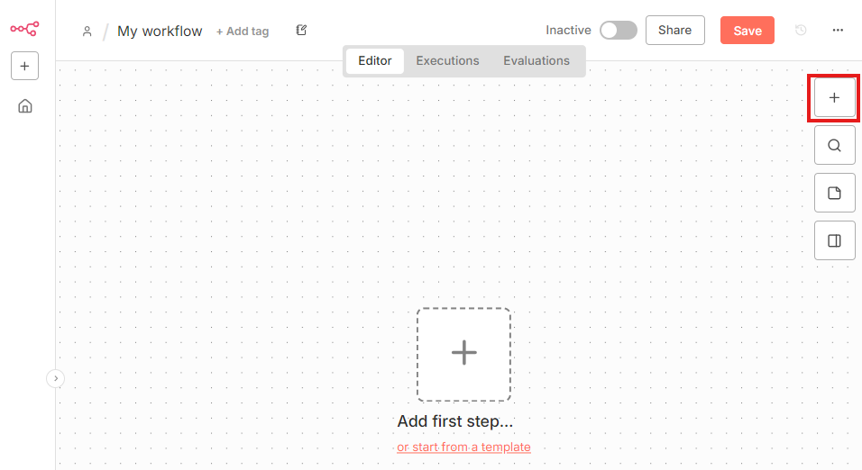
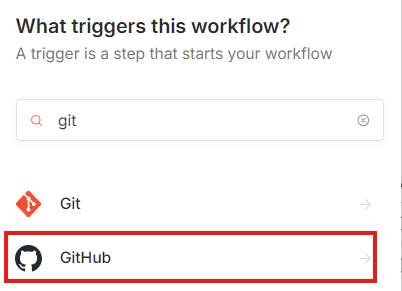
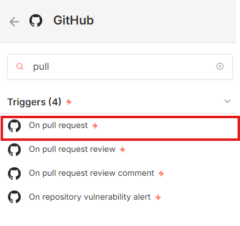
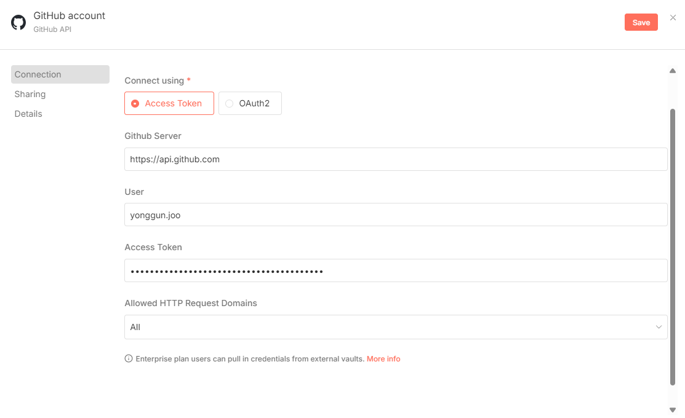
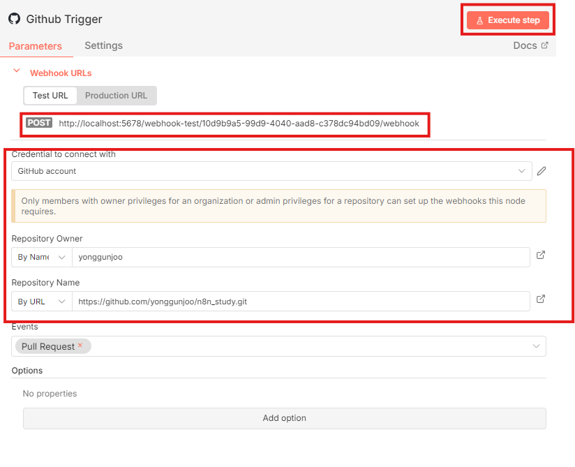

# 코드리뷰봇
- 트리거 추가

# GITHUB 토큰 생성
https://github.com/settings/apps

# 연결 설정
- Credential to connect with 설정
  - 사전작업 : Github Token 발급 Settings > Personal access token > tokens(classic)

- 아래 이미지와 같이 설정 완료 후 Test URL 복사
- Execute step 버튼 클릭

#TODO : 불필요한 주석 제거 테스트 

