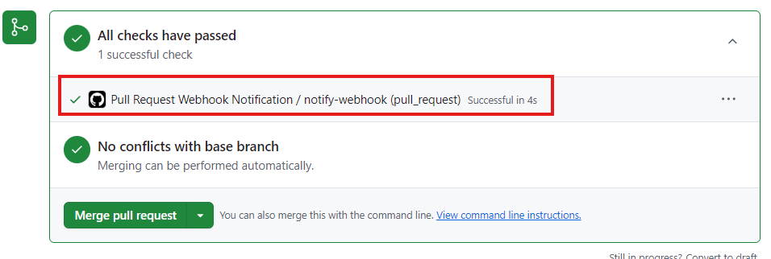
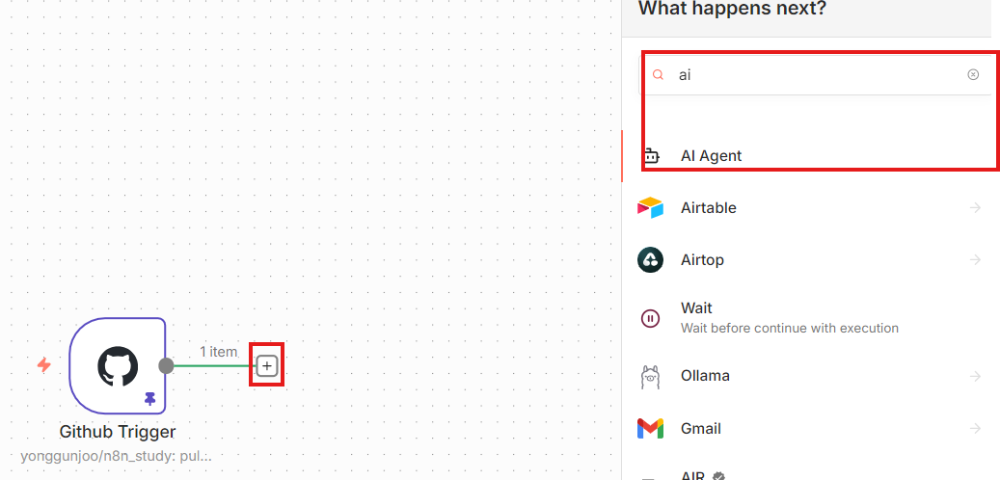
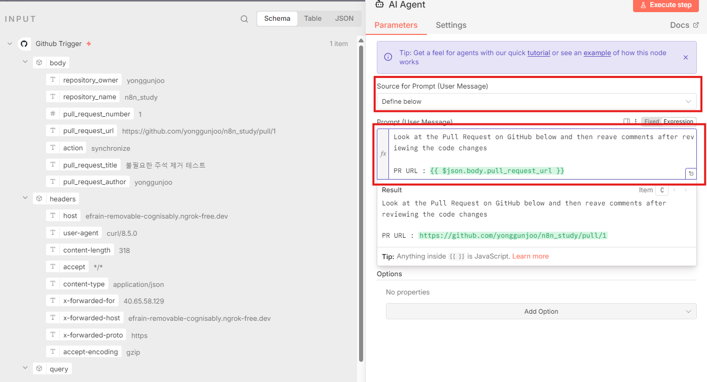
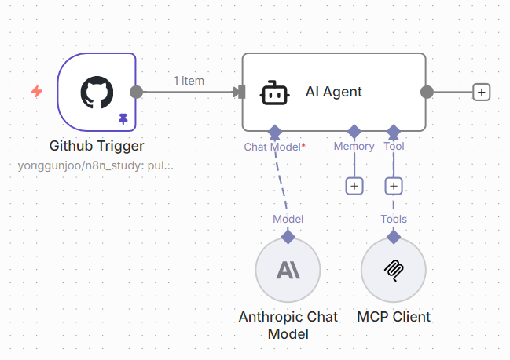
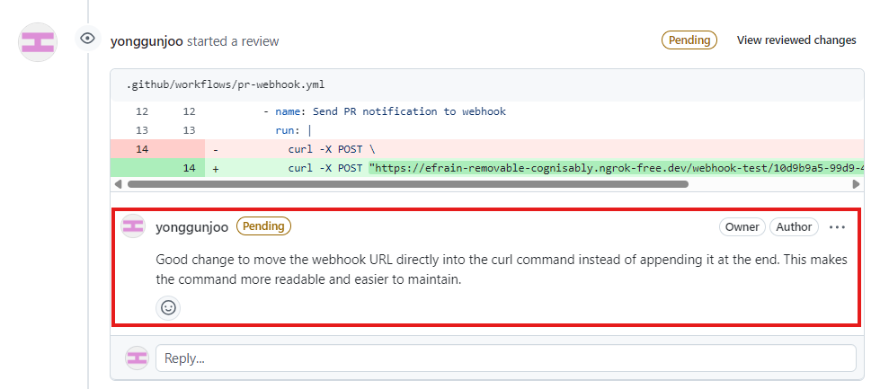

# 코드리뷰봇
- 트리거 추가

# GITHUB 토큰 생성
https://github.com/settings/apps

# 연결 설정
- Credential to connect with 설정
  - 사전작업 : Github Token 발급 Settings > Personal access token > tokens(classic)

- 아래 이미지와 같이 설정 완료 후 Test URL 복사
- Execute step 버튼 클릭

- PR Webhook 단계를 성공하고 요청 결과를 확인

# AddedAI Agent 추가
- '+' 버튼을 클릭하여 AI Agent 추가

- AI Agent 설정

- Chat Model 추가
- Tool : github MCP 추가
  - https://github.com/github/github-mcp-server
  - end point : https://api.githubcopilot.com/mcp/
  - github Bearer 입력

# 결과
